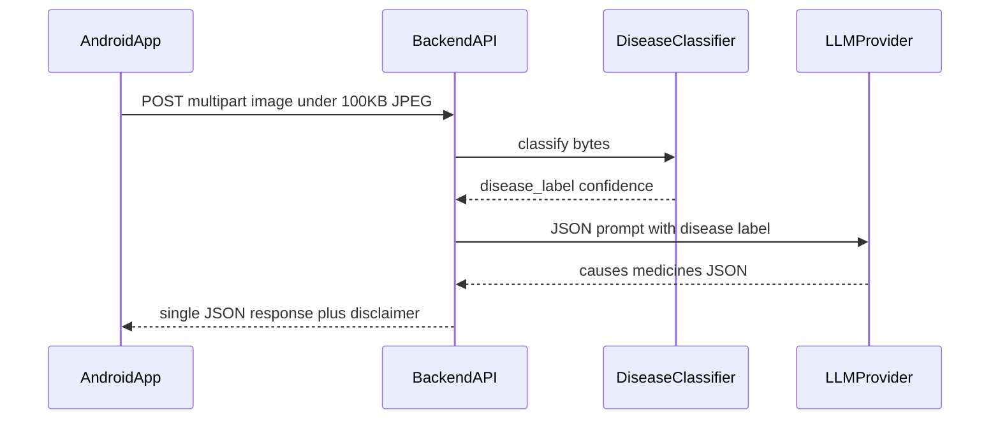

# Plant disease detection (Android + cloud + LLM)

Cross-cutting plant health assistant: an **Android** client compresses leaf photos to a **small JPEG (target ≤ 100 KB)** and sends **one** HTTPS request to a **FastAPI** backend. The server runs a **pluggable image classifier** (stub by default) and, when configured, an **OpenAI-compatible LLM** to fill in **causes** and **treatment-oriented suggestions**. Results are shown in a simple **three-section table** (disease name, causes, medicines/treatment).

This layout favors **small APK size** (no on-device ML), **low upload size** for **3G-style** links, and **one round trip** per diagnosis.

## Features (mapped to your goals)

1. **Light on the device** — Android app uses Jetpack Compose, Retrofit, and OkHttp only; no bundled vision model. JPEG downscaling happens in-process without heavy graphics stacks.
2. **Light on the network** — Client encodes JPEG toward **≤ 100 KB** before upload; server accepts up to **~150 KB** by default. **Video / 3GP** is not implemented in v1; see [Future work](#future-work).
3. **Android** — Single-module app under [`android/`](android/).
4. **Tabular output** — UI presents **Name of the disease**, **Causes**, and **Medicines / treatment** with a clear disclaimer.
5. **This README** — Setup, API contract, compression policy, and limitations.

## Architecture



## Repository layout

| Path | Purpose |
|------|---------|
| [`android/`](android/) | Kotlin + Compose client |
| [`server/`](server/) | FastAPI service (`app/main.py`, classifier, LLM client) |
| [`server/.env.example`](server/.env.example) | Environment template (copy to `server/.env`) |
| [`android/local.properties.example`](android/local.properties.example) | Android SDK path template |

Optional later: `models/` or `training/` for real PyTorch/ONNX weights.

## Prerequisites

- **Backend:** Python **3.9+** (3.10+ recommended), `pip`, virtualenv.
- **Android:** **Android Studio** (Koala+ or similar) with **JDK 17** and **Android SDK** (API 35 build tools). Gradle wrapper is included under [`android/`](android/).

## Backend setup

```bash
cd server
python3 -m venv .venv
source .venv/bin/activate   # Windows: .venv\Scripts\activate
pip install -r requirements.txt
cp .env.example .env
# Edit .env: set OPENAI_API_KEY for LLM-backed causes/treatment (optional)
uvicorn app.main:app --reload --host 0.0.0.0 --port 8000
```

### Environment variables

| Variable | Meaning |
|----------|---------|
| `OPENAI_API_KEY` | If set, server calls the chat completions API for causes/treatment JSON. |
| `OPENAI_BASE_URL` | Default `https://api.openai.com/v1` (works with many OpenAI-compatible hosts). |
| `OPENAI_MODEL` | Default `gpt-4o-mini`. |
| `MAX_UPLOAD_BYTES` | Max image body size (default `153600`). |
| `CLASSIFIER_VERSION` | String returned as `model_version` in JSON (default `stub-1.0`). |
| `CORS_ORIGINS` | Comma-separated list or `*` (default `*`). |

Without `OPENAI_API_KEY`, the API still returns **`disease_name`** and **`confidence`** from the classifier, with placeholder text for causes/treatment.

## Android setup

1. Copy [`android/local.properties.example`](android/local.properties.example) to **`android/local.properties`** and set `sdk.dir` to your SDK path (e.g. macOS: `~/Library/Android/sdk`).
2. Open the **`android`** folder in Android Studio **or** run `./gradlew :app:assembleDebug` from `android/`.
3. **Debug** builds use `http://10.0.2.2:8000/` as `API_BASE_URL` (emulator → host loopback). For a **physical device**, use your machine’s LAN IP (e.g. `http://192.168.1.10:8000/`) and ensure the phone can reach the server; **release** builds default to a placeholder HTTPS URL—change [`android/app/build.gradle.kts`](android/app/build.gradle.kts) `release` `API_BASE_URL` before shipping.

Debug builds enable **cleartext HTTP** via [`android/app/src/debug/AndroidManifest.xml`](android/app/src/debug/AndroidManifest.xml) for local development only.

## API contract

### `POST /v1/diagnose`

- **Content-Type:** `multipart/form-data`
- **Parts:**
  - **`image`** (required): image file; `image/jpeg` or `image/png` typical.
  - **`locale`** (optional): hint for the LLM (e.g. `en`).

**Success (200)** — JSON body:

```json
{
  "disease_name": "string",
  "causes": "string",
  "medicines_or_treatment": "string",
  "confidence": 0.82,
  "disclaimer": "string",
  "model_version": "stub-1.0"
}
```

**Errors**

| Code | When |
|------|------|
| `400` | Missing/non-image file, empty upload |
| `413` | Body larger than `MAX_UPLOAD_BYTES` |

### `GET /health`

Returns `{"status":"ok","model_version":"..."}`.

## Image compression policy (Android)

1. Decode with **inSampleSize** so the larger side is roughly bounded before full decode.
2. Prefer **RGB_565** decode to reduce transient memory on low-RAM devices.
3. Iteratively **JPEG compress** (quality steps) and, if needed, **shrink longest side** until size **≤ 100 KB** (best effort; extreme images may slightly exceed).
4. Upload uses field name **`image`**, filename `leaf.jpg`, MIME `image/jpeg`.

## 3G / low-connectivity notes

- **Single request** — Classifier + LLM run on the server in one call; the phone uploads once.
- **Timeouts** — OkHttp uses **45s connect**, **120s read/write** in [`RetrofitFactory.kt`](android/app/src/main/java/com/plantdisease/app/network/RetrofitFactory.kt); tune for your region.
- **Server-side LLM cache** — Repeated **same disease label + locale** skips redundant LLM calls (bounded cache in [`llm_client.py`](server/app/llm_client.py)).

## Swapping in a real classifier

The default [`StubPlantClassifier`](server/app/classifier.py) is deterministic from image bytes (for demos only). To use a real model:

1. Subclass `PlantClassifier` and implement `classify(self, image_bytes: bytes) -> ClassificationResult`.
2. Register it in [`main.py`](server/app/main.py) inside `get_classifier()` (e.g. by environment flag).

Keep **input resolution** aligned with what you expect from **≤100 KB** JPEGs (often 512–768 px longest side).

## Limitations and disclaimer

- **Not a professional diagnosis.** Vision models can be wrong; **LLM text may be incomplete or incorrect** (hallucinations). Always **verify with a qualified agronomist or local agricultural extension service** before chemical use or economic decisions.
- **Stub classifier** labels are **not real predictions**.
- Heavy **JPEG compression** can **lower accuracy** for fine-grained diseases.

## Future work

- **iOS** or shared UI framework if you expand beyond Android.
- **On-device** TensorFlow Lite for offline-first (larger APK).
- **Video** uploads and **3GP** (or modern codecs) with server-side clip sampling.
- **Multilingual** UI and stronger **locale** passed to the LLM.
- **Auth** (short-lived tokens, rate limits, app attestation) for public deployments.

## License

Provide your own license. Third-party models and datasets (if added) must respect **their** licenses.
